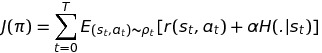
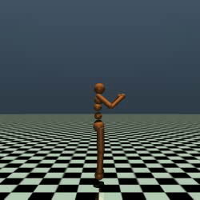
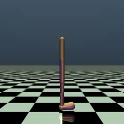
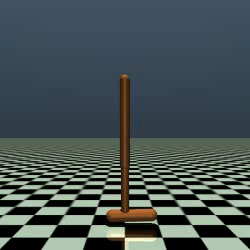
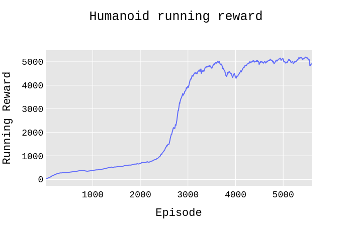
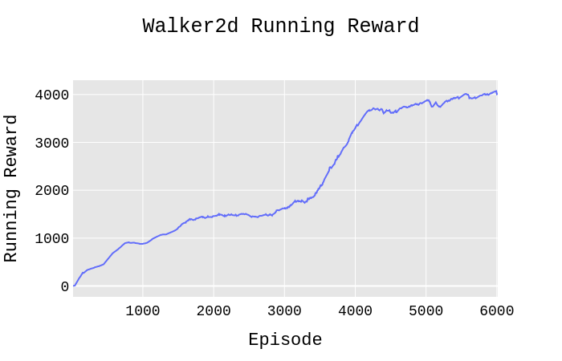
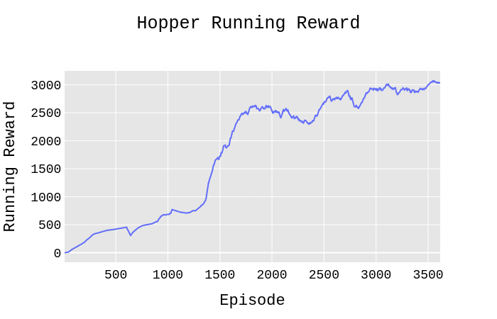

# SAC
Implementation of Soft Actor-Critic: Off-Policy Maximum Entropy Deep Reinforcement Learning with a Stochastic Actor    
>Added another branch for [Soft Actor-Critic Algorithms and Applications ](https://arxiv.org/pdf/1812.05905.pdf) -> [SAC_V1](https://github.com/alirezakazemipour/SAC/tree/SAC_V1).   

Soft Q-Learning uses the following objective function instead of the conventional [expected cumulative return](http://www.cs.ox.ac.uk/people/varun.kanade/teaching/ML-HT2016/lectures/lec11.pdf):  
<p align="center">
   
</p>  
The entropy term is also maximized which have two major benefits:

1. The exploration will be intelligently tuned and maximized as much as need, so the exploration/exploitation trade off is well satisfied.  
2. It prevent the learning procedure to get stuck in a local optima which results to a suboptimal policy.  


## Demos
Humanoid-v2| Walker2d-v2| Hopper-v2
:-----------------------:|:-----------------------:|:-----------------------:|
| | 

## Results
Humanoid-v2| Walker2d-v2| Hopper-v2
:-----------------------:|:-----------------------:|:-----------------------:|
| | 

## Dependencies
- gym == 0.17.2  
- mujoco-py == 2.0.2.13  
- numpy == 1.19.1  
- psutil == 5.4.2  
- torch == 1.4.0  
## Installation
```shell
pip3 install -r requirements.txt
```
## Usage
```bash
python3 main.py
```
- You may use `Train` flag to specify whether to train your agent when it is `True` or test it when the flag is `False`.  
- There are some pre-trained weights in _pre-trained models_ dir, you can test the agent by using them; put them on the root folder of the project and turn `Train` flag to `False`.

## Environment tested
- [x] Humanoid-v2
- [x] Hopper-v2
- [x] Walker2d-v2 
- [ ] HalfCheetah-v2 

## Reference
1. [_Soft Actor-Critic: Off-Policy Maximum Entropy Deep Reinforcement Learning with a Stochastic Actor_, Haarnoja et al., 2018](https://arxiv.org/abs/1801.01290)
2. [_Soft Actor-Critic Algorithms and Applications_, Haarnoja et al., 2018](https://arxiv.org/abs/1812.05905)

## Acknowledgement
All credits goes to [@pranz24](https://github.com/pranz24) for his brilliant Pytorch [implementation of SAC](https://github.com/pranz24/pytorch-soft-actor-critic).  
Special thanks to [@p-christ](https://github.com/p-christ) for [SAC.py](https://github.com/p-christ/Deep-Reinforcement-Learning-Algorithms-with-PyTorch/blob/a8bd4f99f03b7d0a8e3dabd31fdc91490e506221/agents/actor_critic_agents/SAC.py)  
